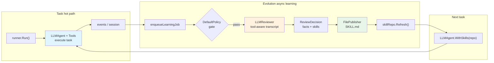

# Evaluating Agent Self-Evolution on the SkillCraft Benchmark

## 1. Introduction

This report uses the **SkillCraft** benchmark
([shiqichen17/SkillCraft](https://github.com/shiqichen17/SkillCraft)) to
evaluate **agent self-evolution** in
[**trpc-agent-go**](https://github.com/trpc-group/trpc-agent-go).

SkillCraft is purpose-built for "reusable skill learning": each task
family ships several variants of the same shape at increasing scale
(`e1` … `e3`, `m1` … `m2`, `h1`). An agent that distills the critical
procedure into a reusable skill on the easier variants should stay
stable on the harder ones. That makes it a clean instrument for
answering:

> **Does an agent that automatically extracts skills in the background,
> persists them as `SKILL.md` files, and warm-starts later tasks with
> them actually do better than an agent that starts from scratch every
> time?**

The study compares two configurations of `trpc-agent-go`:

| Configuration | Description |
| --- | --- |
| **Baseline** | `evolution` disabled. Every task starts from scratch; no skill reuse. |
| **Evolution** | `evolution` enabled. After each session, a background reviewer extracts `SKILL.md` files; later tasks warm-start with them. |

All numbers in this report are extracted directly from the run
artefacts by [`tools/extract_metrics.py`](tools/extract_metrics.py). The
raw extraction output is checked into
[`tools/metrics.json`](tools/metrics.json) so every figure here has a
verifiable provenance.

## 2. Experimental Setup

### 2.1 Benchmark

| Item | Value |
| --- | --- |
| Benchmark | SkillCraft (local scaled tasks) |
| Task families | `openmeteo-weather`, `recipe-cookbook-builder`, `world-bank-economic-snapshot` |
| Variants per family | `e1` / `e2` / `e3` / `m1` / `m2` / `h1` (six, increasing difficulty) |
| Total tasks | 18 |
| Scoring | SkillCraft's official `evaluation/main.py` (not a custom scorer) |
| Agent model | `gpt-4o-mini` |
| Reviewer model | `gpt-4o-mini` |
| Max tool iterations | 16 |
| Comparison mode | `compare` (baseline then evolution, same process) |

The three families cover, respectively, **sequential API orchestration**
(Open-Meteo), **multi-step structured generation** (Recipe Cookbook),
and **multi-entity data aggregation** (World Bank Economic Snapshot),
so the conclusions are not dominated by a single workload.

### 2.2 Scenarios

| Scenario | Description |
| --- | --- |
| **Baseline** | `managed_skills/` stays empty. Each task is solved from the task spec and tool list alone. |
| **Evolution** | A shared `managed_skills/` directory is reused across the 18 tasks. Reviewer output from earlier tasks becomes visible to later tasks. Task #1 is **cold-start**; the remaining 17 are **warm-start**. |

Both configurations share the exact same tools (SkillCraft local tools
MCP + filesystem MCP + `local-write_final_json`), prompts, model,
max-iterations, initial workspace and scoring script. The **only**
variable is whether `evolution` is on.

### 2.3 Evolution in trpc-agent-go

In `trpc-agent-go`, `evolution` is a **lightweight asynchronous
learning loop**. The main agent executes normally; reviewing happens in
the background after the session ends, never on the hot path.

1. **Trigger**: when the session ends, the runner calls
   `EnqueueLearningJob(...)` and hands the delta to `evolution.Service`.
2. **Gate**: `DefaultPolicy` decides whether it is worth learning—only
   sessions with enough tool calls, a user correction, or a tool error
   that was recovered from pass the gate.
3. **Review**: `LLMReviewer` consumes a **tool-aware transcript** (tool
   names, arguments, results) and emits strict-JSON
   `ReviewDecision{facts, skills}`. Long messages are
   **head+tail truncated on the reviewer side** to avoid context
   overflow.
4. **Publish**: `FilePublisher` writes each `SkillSpec` to
   `<managed-skills-dir>/<slug>/SKILL.md`, then `skillRepo.Refresh()`
   makes it visible at runtime.



At runtime, `LLMAgent.WithSkills(repo)` gives the agent visibility into
all managed skill summaries; combined with
`SkillToolProfileKnowledgeOnly` and the `skill_load` tool, the agent
can pull in full skill content on demand. The benchmark's system prompt
explicitly enforces: **the task spec always wins over a learned
skill**—anything the skill does not cover must be re-derived from the
task spec instead of being forced to fit an old skill.

The `evolution` and `skill` packages live in the
[`trpc-agent-go`](https://github.com/trpc-group/trpc-agent-go)
framework repository.

### 2.4 Infrastructure notes

- **MCP bridge**: SkillCraft's Python local tools (e.g.
  `weather_get_historical`, `worldbank_country_info`) are exposed to
  the Go agent via `bridge/skillcraft_local_tools_mcp.py` over stdio.
  Filesystem is the official `@modelcontextprotocol/server-filesystem`.
- **`local-write_final_json`**: an auxiliary Python tool that writes
  the final JSON deliverable to the workspace and transparently
  recovers from common encoding mistakes (JSON-encoded JSON strings,
  literal `\n` characters, etc.), so a transient `file already closed`
  in the filesystem MCP does not fail the task.
- **Context compaction**: `llmagent.WithEnableContextCompaction` is
  enabled. Historical tool results are replaced by an explicit
  placeholder ("previous tool call succeeded and its result was already
  consumed … do NOT re-invoke") so the model does not mistake a
  compacted success for a failed call and retry forever.

---

## 3. Main Results

All tables below come directly from running

```bash
python3 skillcraft/results/tools/extract_metrics.py \
    skillcraft/results/multi_family_compare --format md
```

against [`multi_family_compare/results.json`](multi_family_compare/results.json).

### 3.1 Overall metrics

**Table 1: Baseline vs Evolution**

| Scenario | Pass / Total | Pass Rate | Avg Score | Agent Tokens/Task | Reviewer Tokens/Task | End-to-End Tokens/Task | Avg Duration | Claim-done Rate |
| --- | ---: | ---: | ---: | ---: | ---: | ---: | ---: | ---: |
| Baseline | 15 / 18 | 83.33% | 80.46 | 185,590 | – | 185,590 | 98.9s | 77.78% |
| **Evolution** | **18 / 18** | **100.00%** | **97.68** | **118,670** | 10,243 | **128,913** | **79.7s** | **100.00%** |
| **Δ (Evo − Base)** | **+3** | **+16.67pp** | **+17.22** | **−36.06%** | – | **−30.54%** | **−19.46%** | **+22.22pp** |

> Evolution lifts pass rate from 83.33% to **100%** and average score by
> **+17.22 pp**. Even after paying for the reviewer LLM, evolution uses
> **30.54% fewer end-to-end tokens** and **19.46% less wall-clock time**
> than baseline.

**Table 2: Warm-start vs cold-start inside Evolution**

| Phase | Tasks | Pass Rate | Avg Score | End-to-End Tokens/Task | Avg Duration |
| --- | ---: | ---: | ---: | ---: | ---: |
| Cold-start (task #1) | 1 | 100.00% | 100.00 | 93,252 | 56.5s |
| Warm-start (remaining 17) | 17 | 100.00% | 97.55 | 131,011 | 81.0s |

> The first task has no skill available (it is effectively a baseline
> run) and still passes. The remaining 17 warm-start runs benefit from
> the growing pool of `SKILL.md` files, and that is where evolution's
> wins come from.

### 3.2 Per family

**Table 3: by task family**

| Family | Tasks | Baseline Pass | Baseline Avg Score | Baseline Avg Agent Tokens | Evolution Pass | Evolution Avg Score | Evolution Avg Agent Tokens |
| --- | ---: | ---: | ---: | ---: | ---: | ---: | ---: |
| `openmeteo-weather` | 6 | 5/6 | 81.28 | 210,685 | **6/6** | **97.95** | **105,838** |
| `recipe-cookbook-builder` | 6 | 6/6 | 93.43 | 175,231 | **6/6** | **95.10** | **123,503** |
| `world-bank-economic-snapshot` | 6 | 4/6 | 66.67 | 170,856 | **6/6** | **100.00** | **126,669** |

> Agent token usage drops on every family. The biggest pass-rate swing
> is `world-bank-economic-snapshot` (4/6 → 6/6, score 66.67 → 100.00).
> Even on `recipe-cookbook-builder`, where baseline already passes 6/6,
> evolution still nudges the average score up and saves about
> **30%** of agent tokens (175k → 124k).

### 3.3 Per task

**Table 4: all 18 tasks**

| Task | B Pass | B Score | B Tokens | E Pass | E Score | E Tokens |
| --- | :---: | ---: | ---: | :---: | ---: | ---: |
| openmeteo-weather/e1 | × | 0.0 | 714,167 | ✓ | 100.0 | 84,959 |
| openmeteo-weather/e2 | ✓ | 100.0 | 72,641 | ✓ | 100.0 | 77,651 |
| openmeteo-weather/e3 | ✓ | 95.0 | 72,278 | ✓ | 95.0 | 100,107 |
| openmeteo-weather/h1 | ✓ | 96.7 | 172,117 | ✓ | 96.7 | 125,557 |
| openmeteo-weather/m1 | ✓ | 100.0 | 101,619 | ✓ | 100.0 | 107,369 |
| openmeteo-weather/m2 | ✓ | 96.0 | 131,287 | ✓ | 96.0 | 139,386 |
| recipe-cookbook-builder/e1 | ✓ | 94.3 | 99,147 | ✓ | 94.3 | 72,017 |
| recipe-cookbook-builder/e2 | ✓ | 91.7 | 305,005 | ✓ | 96.7 | 69,156 |
| recipe-cookbook-builder/e3 | ✓ | 91.7 | 116,444 | ✓ | 96.7 | 79,573 |
| recipe-cookbook-builder/h1 | ✓ | 94.3 | 324,197 | ✓ | 94.3 | 213,779 |
| recipe-cookbook-builder/m1 | ✓ | 94.3 | 88,445 | ✓ | 94.3 | 132,049 |
| recipe-cookbook-builder/m2 | ✓ | 94.3 | 118,146 | ✓ | 94.3 | 174,443 |
| world-bank-economic-snapshot/e1 | ✓ | 100.0 | 67,222 | ✓ | 100.0 | 77,008 |
| world-bank-economic-snapshot/e2 | × | 0.0 | 307,614 | ✓ | 100.0 | 101,499 |
| world-bank-economic-snapshot/e3 | ✓ | 100.0 | 49,284 | ✓ | 100.0 | 92,493 |
| world-bank-economic-snapshot/h1 | ✓ | 100.0 | 126,349 | ✓ | 100.0 | 248,975 |
| world-bank-economic-snapshot/m1 | ✓ | 100.0 | 124,263 | ✓ | 100.0 | 110,672 |
| world-bank-economic-snapshot/m2 | × | 0.0 | 350,403 | ✓ | 100.0 | 129,368 |

> All three baseline failures are **catastrophic "burn tokens without
> answering"** cases: `openmeteo-weather/e1` (714k tokens),
> `world-bank-economic-snapshot/e2` (308k tokens), and
> `world-bank-economic-snapshot/m2` (350k tokens). Each is an agent
> trapped in a retry loop against the same tool until
> `max tool iterations`. Evolution finishes the same tasks at 85k–130k
> tokens with no failure, because the previously-learned `SKILL.md`
> tells the agent which tool to call in which order.

### 3.4 Learned skills

The evolution arm produced **16 `SKILL.md`** files
(`multi_family_compare/managed_skills/`), covering all three families:

```
Collect Weather Data for Five Cities with Historical Data
Collect Weather Data for Four Cities with Historical Data
Collect Weather Data for Four Cities with Summary Statistics
Collect Weather Data for Multiple Cities
Collect Weather Data for Three Cities with Historical Data
Collect Weather Data for Three Cities with Summary Statistics
Create Cookbook for Four International Dishes
Create Economic Snapshot for Five Countries
Create Economic Snapshot for Four Countries
Create Economic Snapshot for Three Countries
Create Economic Snapshots for Multiple Countries
Create Recipe Cookbook for Five International Dishes
Create Recipe Cookbook for Four International Dishes
Create Recipe Cookbook with 3 International Dishes
Create Recipe Cookbook with International Dishes
Create Recipe Cookbook with Specific Dishes
```

Each `SKILL.md` is short markdown with a `name` / `description` front
matter and the three-section body `When to use` / `Steps` / `Pitfalls`.
For example,
[`Collect Weather Data for Three Cities with Historical Data`](multi_family_compare/managed_skills/collect-weather-data-for-three-cities-with-historical-data/SKILL.md):

```markdown
---
name: Collect Weather Data for Three Cities with Historical Data
description: Collect weather data for three specified cities using three API endpoints ...
---

## Steps
1. Define the three cities for data collection along with their latitude and longitude.
2. Use the `local-weather_get_coordinates` tool first to get the coordinates for each city.
3. Use the `local-weather_get_daily` tool to get the daily forecast for each city.
4. Use the `local-weather_get_historical` tool to collect 30 days of historical data for each city.
5. Compile the data into a structured JSON format including global summary statistics ...

## Pitfalls
- Ensure the correct order of API calls: weather_get_coordinates must be first.
- Handle potential API errors or timeouts when retrieving historical data.
```

These are **authored by the agent, consumed by the agent**, with no
manual editing.

---

## 4. Conclusions

### Key findings

1. **Evolution is a clear win.** `evolution` lifts pass rate from
   83.33% to **100%**, average score to **97.68**, and uses
   **30.54% fewer end-to-end tokens** and **19.46% less wall-clock
   time** than baseline. The reviewer's LLM cost is already paid off.

2. **Most of the win is "eliminating catastrophic failures", not
   "bumping easy scores".** All three baseline failures are
   `max tool iterations` retry loops (308k–714k tokens). Evolution
   finishes the same tasks in 85k–130k tokens because `SKILL.md` gives
   the agent an explicit call order plus pitfall list that kicks it
   out of the loopy branch.

3. **`SKILL.md` is a reviewable artefact, not an invisible embedding.**
   The 16 skills produced are short markdown files that a human can
   read, version-control, and hand-edit. That is a concrete engineering
   advantage over embedding-only procedural memory.

4. **The win generalises across all three task families.**
   `world-bank-economic-snapshot` benefits the most (+33.33 pp pass
   rate, +33.33 average score). `openmeteo-weather` gets +16.67 pp /
   +16.67. Even on `recipe-cookbook-builder`, where baseline is
   already 6/6, evolution still lifts average score from 93.43 to
   95.10 and saves ~30% of agent tokens.

### Production guidance

| When | Recommendation |
| --- | --- |
| Repeating same-shape tasks (ETL, reports, scraping) | Turn `evolution` on and let the skill set accumulate. |
| Latency / cost-sensitive single-shot tasks | Still safe to enable—review runs asynchronously after the session and never blocks the hot path. |
| Task shapes change quickly and skills age fast | Tighten the policy (raise the tool-call threshold, or gate on human review of `SKILL.md`). |
| Internal platform / automation pipeline | Treat `managed_skills/` as a versioned artefact—commit it or upload to an artefact store for audit and rollback. |

---

## Appendix

### A. Environment

| Component | Version / Config |
| --- | --- |
| Framework | [`trpc-agent-go`](https://github.com/trpc-group/trpc-agent-go) (includes `evolution/`, `skill/`) |
| Agent model | `gpt-4o-mini` |
| Reviewer model | `gpt-4o-mini` |
| SkillCraft | Local checkout of [shiqichen17/SkillCraft](https://github.com/shiqichen17/SkillCraft); scoring via official `evaluation/main.py` |
| MCP bridge | `bridge/skillcraft_local_tools_mcp.py` (stdio) + `@modelcontextprotocol/server-filesystem` |
| Extra tool | `local-write_final_json` (robust JSON writer) |
| Context compaction | `WithEnableContextCompaction` enabled; oversized tool-result cap 1024 tokens |
| Reviewer truncation | `WithMessageContentMaxChars(2000)` (set by the benchmark) |
| Max tool iterations | 16 |

### B. Reproducing the numbers

```bash
export SKILLCRAFT_ROOT=/path/to/SkillCraft
export OPENAI_API_KEY=...

cd skillcraft/trpc-agent-go-impl

go run . \
  -skillcraft-root "$SKILLCRAFT_ROOT" \
  -tasks "openmeteo-weather/e1,openmeteo-weather/e2,openmeteo-weather/e3,openmeteo-weather/h1,openmeteo-weather/m1,openmeteo-weather/m2,recipe-cookbook-builder/e1,recipe-cookbook-builder/e2,recipe-cookbook-builder/e3,recipe-cookbook-builder/h1,recipe-cookbook-builder/m1,recipe-cookbook-builder/m2,world-bank-economic-snapshot/e1,world-bank-economic-snapshot/e2,world-bank-economic-snapshot/e3,world-bank-economic-snapshot/h1,world-bank-economic-snapshot/m1,world-bank-economic-snapshot/m2" \
  -mode compare \
  -model gpt-4o-mini \
  -reviewer-model gpt-4o-mini \
  -max-tool-iterations 16 \
  -output ../results/multi_family_compare
```

Then re-extract the metrics into machine-readable form:

```bash
python3 skillcraft/results/tools/extract_metrics.py \
    skillcraft/results/multi_family_compare           # JSON (default)

python3 skillcraft/results/tools/extract_metrics.py \
    skillcraft/results/multi_family_compare --format md
```

### C. Raw data

The numbers in this report come from
[`multi_family_compare/`](multi_family_compare/). The directory
contains:

- `results.json` — structured benchmark results (summary + per-task)
- `REPORT.md` — auto-generated single-run summary
- `managed_skills/` — the 16 `SKILL.md` files learned in the run
- `workspaces/` — per-task working directories with each agent's final
  deliverables (`*.json`)

The exact values cited in §3 are also persisted as the snapshot
[`tools/metrics.json`](tools/metrics.json) so the report can be
audited without re-running the benchmark.

---

## References

1. Chen, S. et al. "SkillCraft." GitHub:
   [shiqichen17/SkillCraft](https://github.com/shiqichen17/SkillCraft).
2. The `trpc-agent-go` framework, including the `evolution/` and
   `skill/` packages used by this benchmark:
   [trpc-group/trpc-agent-go](https://github.com/trpc-group/trpc-agent-go).
