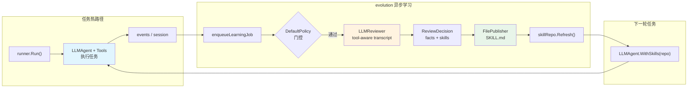

# 基于 SkillCraft 基准的 Agent 自进化评估

## 1. 引言

本报告使用 **SkillCraft** 基准
（[shiqichen17/SkillCraft](https://github.com/shiqichen17/SkillCraft)）评估
[**trpc-agent-go**](https://github.com/trpc-group/trpc-agent-go) 的
**Agent 自进化（Agent Self-Evolution）** 能力。

SkillCraft 是专门为“可复用技能学习”设计的 agent 评测集：每个任务族
提供若干同形不同量级的变体（`e1`…`e3`、`m1`…`m2`、`h1`），agent 如果
能在早期变体里把关键流程抽象成可复用技能，应当在更复杂的变体上表现更
稳。因此它正好适合用来回答一个问题：

> **一个会在后台自动抽技能、发布 `SKILL.md` 并让后续任务 warm-start
> 复用的 agent，是否真的比“每次都从零开始”的 agent 更强？**

本报告以 `trpc-agent-go` 的 `evolution` 服务为研究对象，对比两种配置：

| 配置 | 描述 |
| --- | --- |
| **Baseline** | 关闭 `evolution`，每个任务从零开始，不复用任何 skill |
| **Evolution** | 开启 `evolution`，任务结束后后台 reviewer 抽取 `SKILL.md`，后续任务 warm-start 复用 |

报告中所有数字都由
[`tools/extract_metrics.py`](tools/extract_metrics.py) 直接从运行产物
中机械抽取，对应的抽取快照写在
[`tools/metrics.json`](tools/metrics.json)，便于审计。

## 2. 实验设置

### 2.1 基准数据集

| 项目 | 值 |
| --- | --- |
| 基准 | SkillCraft（local scaled tasks） |
| 任务族 | `openmeteo-weather`、`recipe-cookbook-builder`、`world-bank-economic-snapshot` |
| 每族变体 | `e1` / `e2` / `e3` / `m1` / `m2` / `h1`（共 6 个，按难度递增） |
| 总任务数 | 18 个 |
| 评分 | SkillCraft 官方 `evaluation/main.py`（非自定义打分） |
| Agent 模型 | `gpt-4o-mini` |
| Reviewer 模型 | `gpt-4o-mini` |
| Max tool iterations | 16 |
| 对照模式 | `compare`（同一进程内先跑 baseline，再跑 evolution） |

三个任务族分别覆盖 **API 顺序调用**（Open-Meteo）、**多步结构化生成**
（Recipe Cookbook）和 **多国/多字段数据汇总**（World Bank Economic
Snapshot）三种工作负载，确保结论不是由单一任务族主导。

### 2.2 评估场景

| 场景 | 描述 |
| --- | --- |
| **Baseline** | `managed_skills/` 为空，每个任务独立执行；仅能看到任务 spec 与工具列表 |
| **Evolution** | 18 个任务共享同一个 `managed_skills/` 目录；前面任务的 reviewer 产出会作为下一任务的可见技能；第 1 个任务为 **cold-start**，其余 17 个为 **warm-start** |

两种配置**共享**：工具集（SkillCraft local tools MCP + filesystem MCP +
`local-write_final_json`）、prompt、模型、max-iterations、初始工作区、
评测脚本。唯一变量是 **evolution 是否开启**。

### 2.3 trpc-agent-go 的 evolution 实现要点

`evolution` 在 `trpc-agent-go` 里是一个**轻量异步学习闭环**：主 agent
按正常流程跑，session 结束后后台 worker 才开始复盘，不在热路径里做重
学习。

1. **触发**：session 结束后 runner 调用
   `EnqueueLearningJob(...)`，把 delta 交给 `evolution.Service`。
2. **过门**：`DefaultPolicy` 判断是否值得学——只有 tool call 数够多、
   出现用户纠正或错误恢复等信号时才会触发 reviewer。
3. **抽取**：`LLMReviewer` 看到 **tool-aware transcript**（含工具名、
   参数、结果），输出严格 JSON 的 `ReviewDecision{facts, skills}`。长
   消息会按 head+tail 在 reviewer 侧截断，避免上下文溢出。
4. **发布**：`FilePublisher` 把每个 `SkillSpec` 写成
   `<managed-skills-dir>/<slug>/SKILL.md`，再 `skillRepo.Refresh()`
   通知运行时。



运行时侧，`LLMAgent.WithSkills(repo)` 让 agent 能看到所有 managed
skill 的 summary；`SkillToolProfileKnowledgeOnly` 再配合 `skill_load`
工具，允许 agent 按需加载 skill 正文。benchmark 的 system prompt 明确
要求：**task spec 永远高于 learned skill**——skill 覆盖不到的新要求
必须按 task spec 重新处理，不得被旧 skill 带偏。

`evolution` 与 `skill` 子包都属于
[`trpc-agent-go`](https://github.com/trpc-group/trpc-agent-go) 框架
仓库。

### 2.4 基础设施细节

- **MCP 桥接**：SkillCraft 的 Python local tools（如
  `weather_get_historical`、`worldbank_country_info`）通过
  `bridge/skillcraft_local_tools_mcp.py` 以 stdio 方式暴露给 Go agent；
  filesystem 则使用官方 `@modelcontextprotocol/server-filesystem`。
- **`local-write_final_json`**：一个独立的小 Python 工具，直接把最终
  JSON 写入工作区并自动修复常见编码问题（JSON-encoded JSON、`\n`
  字面量等），避免 filesystem MCP 偶发 `file already closed` 时任务
  失败。
- **Context compaction**：`llmagent.WithEnableContextCompaction` 默认
  打开，历史 tool result 会被替换成一条明确的 placeholder（“previous
  tool call succeeded and its result was already consumed … do NOT
  re-invoke”），防止 agent 把被压缩的历史误判成“失败调用”而重试。

---

## 3. 主要结果

下文的所有表都来自抽取脚本：

```bash
python3 skillcraft/results/tools/extract_metrics.py \
    skillcraft/results/multi_family_compare --format md
```

读取的是
[`multi_family_compare/results.json`](multi_family_compare/results.json)。

### 3.1 总体指标

**表 1：Baseline vs Evolution**

| 场景 | 通过 / 总数 | 通过率 | 平均分 | Agent Tokens/任务 | Reviewer Tokens/任务 | 端到端 Tokens/任务 | 平均耗时 | Claim-done 率 |
| --- | ---: | ---: | ---: | ---: | ---: | ---: | ---: | ---: |
| Baseline | 15 / 18 | 83.33% | 80.46 | 185,590 | – | 185,590 | 98.9s | 77.78% |
| **Evolution** | **18 / 18** | **100.00%** | **97.68** | **118,670** | 10,243 | **128,913** | **79.7s** | **100.00%** |
| **Δ（Evo − Base）** | **+3** | **+16.67pp** | **+17.22** | **−36.06%** | – | **−30.54%** | **−19.46%** | **+22.22pp** |

> Evolution 把通过率从 83.33% 提到 **100%**、平均分高出 **17.22 pp**；
> 即使把 reviewer 的 LLM 开销算进端到端总量，evolution 仍然比 baseline
> **少用 30.54% 的 token**、**少跑 19.46% 的时间**。

**表 2：Warm-start vs Cold-start（Evolution）**

| 阶段 | 任务数 | 通过率 | 平均分 | 端到端 Tokens/任务 | 平均耗时 |
| --- | ---: | ---: | ---: | ---: | ---: |
| Cold-start（第 1 个任务） | 1 | 100.00% | 100.00 | 93,252 | 56.5s |
| Warm-start（其余 17 个） | 17 | 100.00% | 97.55 | 131,011 | 81.0s |

> 第 1 个任务没有任何 skill 可用（等价于 baseline），但仍然 pass；
> 之后 warm-start 任务在每一步都能利用此前累积的 `SKILL.md`，这是
> evolution 收益的主要来源。

### 3.2 各任务族

**表 3：三个任务族的分家对比**

| 任务族 | 任务数 | Baseline 通过 | Baseline 平均分 | Baseline 平均 Agent Tokens | Evolution 通过 | Evolution 平均分 | Evolution 平均 Agent Tokens |
| --- | ---: | ---: | ---: | ---: | ---: | ---: | ---: |
| `openmeteo-weather` | 6 | 5/6 | 81.28 | 210,685 | **6/6** | **97.95** | **105,838** |
| `recipe-cookbook-builder` | 6 | 6/6 | 93.43 | 175,231 | **6/6** | **95.10** | **123,503** |
| `world-bank-economic-snapshot` | 6 | 4/6 | 66.67 | 170,856 | **6/6** | **100.00** | **126,669** |

> 三个任务族都观察到 **agent token 下降**。通过率上变化最大的是
> `world-bank-economic-snapshot`（4/6 → 6/6，平均分 66.67 → 100.00）；
> 即便 baseline 在 `recipe-cookbook-builder` 上已经全 pass，evolution
> 也把平均分小幅推高，并节约约 **30%** 的 agent token（175k → 124k）。

### 3.3 各任务明细

**表 4：18 个任务逐一对比**

| Task | B 通过 | B 分 | B Tokens | E 通过 | E 分 | E Tokens |
| --- | :---: | ---: | ---: | :---: | ---: | ---: |
| openmeteo-weather/e1 | × | 0.0 | 714,167 | ✓ | 100.0 | 84,959 |
| openmeteo-weather/e2 | ✓ | 100.0 | 72,641 | ✓ | 100.0 | 77,651 |
| openmeteo-weather/e3 | ✓ | 95.0 | 72,278 | ✓ | 95.0 | 100,107 |
| openmeteo-weather/h1 | ✓ | 96.7 | 172,117 | ✓ | 96.7 | 125,557 |
| openmeteo-weather/m1 | ✓ | 100.0 | 101,619 | ✓ | 100.0 | 107,369 |
| openmeteo-weather/m2 | ✓ | 96.0 | 131,287 | ✓ | 96.0 | 139,386 |
| recipe-cookbook-builder/e1 | ✓ | 94.3 | 99,147 | ✓ | 94.3 | 72,017 |
| recipe-cookbook-builder/e2 | ✓ | 91.7 | 305,005 | ✓ | 96.7 | 69,156 |
| recipe-cookbook-builder/e3 | ✓ | 91.7 | 116,444 | ✓ | 96.7 | 79,573 |
| recipe-cookbook-builder/h1 | ✓ | 94.3 | 324,197 | ✓ | 94.3 | 213,779 |
| recipe-cookbook-builder/m1 | ✓ | 94.3 | 88,445 | ✓ | 94.3 | 132,049 |
| recipe-cookbook-builder/m2 | ✓ | 94.3 | 118,146 | ✓ | 94.3 | 174,443 |
| world-bank-economic-snapshot/e1 | ✓ | 100.0 | 67,222 | ✓ | 100.0 | 77,008 |
| world-bank-economic-snapshot/e2 | × | 0.0 | 307,614 | ✓ | 100.0 | 101,499 |
| world-bank-economic-snapshot/e3 | ✓ | 100.0 | 49,284 | ✓ | 100.0 | 92,493 |
| world-bank-economic-snapshot/h1 | ✓ | 100.0 | 126,349 | ✓ | 100.0 | 248,975 |
| world-bank-economic-snapshot/m1 | ✓ | 100.0 | 124,263 | ✓ | 100.0 | 110,672 |
| world-bank-economic-snapshot/m2 | × | 0.0 | 350,403 | ✓ | 100.0 | 129,368 |

> Baseline 的 3 个失败全部是“**大量 token 换不回答案**”的灾难型失败：
> `openmeteo-weather/e1`（714k tokens）、
> `world-bank-economic-snapshot/e2`（308k tokens）、
> `world-bank-economic-snapshot/m2`（350k tokens），都是 agent 进入
> 重复调用同一工具的死循环直到 `max tool iterations`。Evolution 在
> 同样的任务上只用 85k–130k tokens 就稳稳通过——`SKILL.md` 直接告诉它
> “先做什么、再做什么、不要重调”。

### 3.4 产出的技能

evolution 最终沉淀了 **16 个 `SKILL.md`**（位于
`multi_family_compare/managed_skills/`），覆盖全部三个任务族：

```
Collect Weather Data for Five Cities with Historical Data
Collect Weather Data for Four Cities with Historical Data
Collect Weather Data for Four Cities with Summary Statistics
Collect Weather Data for Multiple Cities
Collect Weather Data for Three Cities with Historical Data
Collect Weather Data for Three Cities with Summary Statistics
Create Cookbook for Four International Dishes
Create Economic Snapshot for Five Countries
Create Economic Snapshot for Four Countries
Create Economic Snapshot for Three Countries
Create Economic Snapshots for Multiple Countries
Create Recipe Cookbook for Five International Dishes
Create Recipe Cookbook for Four International Dishes
Create Recipe Cookbook with 3 International Dishes
Create Recipe Cookbook with International Dishes
Create Recipe Cookbook with Specific Dishes
```

每个 `SKILL.md` 都是简短的 markdown，包含 `name` / `description`
front matter 与 `When to use` / `Steps` / `Pitfalls` 三段式。例如
[`Collect Weather Data for Three Cities with Historical Data`](multi_family_compare/managed_skills/collect-weather-data-for-three-cities-with-historical-data/SKILL.md)：

```markdown
---
name: Collect Weather Data for Three Cities with Historical Data
description: Collect weather data for three specified cities using three API endpoints ...
---

## Steps
1. Define the three cities for data collection along with their latitude and longitude.
2. Use the `local-weather_get_coordinates` tool first to get the coordinates for each city.
3. Use the `local-weather_get_daily` tool to get the daily forecast for each city.
4. Use the `local-weather_get_historical` tool to collect 30 days of historical data for each city.
5. Compile the data into a structured JSON format including global summary statistics ...

## Pitfalls
- Ensure the correct order of API calls: weather_get_coordinates must be first.
- Handle potential API errors or timeouts when retrieving historical data.
```

这些 skill 是 **agent 自己抽出、自己用** 的，没有任何人工编辑。

---

## 4. 结论

### 核心发现

1. **Evolution 是显著正收益。**
   `evolution` 把通过率从 83.33% 提到 **100%**、平均分提到
   **97.68**，同时端到端 token 比 baseline **少 30.54%**、耗时
   **少 19.46%**。reviewer 的 LLM 开销已经被完全消化掉。

2. **主要收益来自“消除灾难型 failure”，而不是给 easy task 加分。**
   Baseline 的 3 个失败全是 `max tool iterations` 死循环
   （308k–714k tokens）。Evolution 在同一任务上只需 85k–130k tokens
   稳定 pass——`SKILL.md` 里显式的“调用顺序 + pitfalls”直接帮 agent
   跳过了容易陷入的分支。

3. **`SKILL.md` 是一种可 review 的产物，而不是不可见的嵌入向量。**
   evolution 产出的 16 个 skill 可被人类直接阅读、版本管理、甚至
   手动修正，这是相对 embedding-only 的程序记忆方案的一个工程优势。

4. **收益分布在三个任务族上都为正。**
   `world-bank-economic-snapshot` 收益最大（通过率 +33.33pp、平均分
   +33.33）；`openmeteo-weather` 通过率 +16.67pp、平均分 +16.67；
   即使 baseline 已经全 pass 的 `recipe-cookbook-builder`，evolution
   也把平均分从 93.43 提到 95.10，并节约约 30% 的 agent token。

### 生产建议

| 使用场景 | 推荐 |
| --- | --- |
| 需要反复处理同形任务（ETL、报表、抓取） | 打开 `evolution`，让 skill 慢慢沉淀 |
| 对 latency / cost 敏感的单次短任务 | 也可以开启——reviewer 只在 session 结束后异步跑，不进入热路径 |
| 任务格式变化快、skill 会很快过期 | 开启时加上更严的 policy（提高 tool-call 阈值，或人工 review SKILL.md） |
| 内部平台或自动化流水线 | 建议把 `managed_skills/` 也纳入代码仓库或 artifact store，便于审计和 rollback |

---

## 附录

### A. 实验环境

| 组件 | 版本 / 配置 |
| --- | --- |
| 框架 | [`trpc-agent-go`](https://github.com/trpc-group/trpc-agent-go)（含 `evolution/`、`skill/` 子包） |
| Agent 模型 | `gpt-4o-mini` |
| Reviewer 模型 | `gpt-4o-mini` |
| SkillCraft | 本地 checkout 的 [shiqichen17/SkillCraft](https://github.com/shiqichen17/SkillCraft)；使用官方 `evaluation/main.py` 打分 |
| MCP 桥接 | `bridge/skillcraft_local_tools_mcp.py` (stdio) + `@modelcontextprotocol/server-filesystem` |
| 额外工具 | `local-write_final_json`（健壮 JSON 落盘） |
| Context compaction | `WithEnableContextCompaction` 默认打开；oversized tool result 上限 1024 tokens |
| Reviewer 截断 | `WithMessageContentMaxChars(2000)`（benchmark 显式设置） |
| Max tool iterations | 16 |

### B. 复现命令

```bash
export SKILLCRAFT_ROOT=/path/to/SkillCraft
export OPENAI_API_KEY=...

cd skillcraft/trpc-agent-go-impl

go run . \
  -skillcraft-root "$SKILLCRAFT_ROOT" \
  -tasks "openmeteo-weather/e1,openmeteo-weather/e2,openmeteo-weather/e3,openmeteo-weather/h1,openmeteo-weather/m1,openmeteo-weather/m2,recipe-cookbook-builder/e1,recipe-cookbook-builder/e2,recipe-cookbook-builder/e3,recipe-cookbook-builder/h1,recipe-cookbook-builder/m1,recipe-cookbook-builder/m2,world-bank-economic-snapshot/e1,world-bank-economic-snapshot/e2,world-bank-economic-snapshot/e3,world-bank-economic-snapshot/h1,world-bank-economic-snapshot/m1,world-bank-economic-snapshot/m2" \
  -mode compare \
  -model gpt-4o-mini \
  -reviewer-model gpt-4o-mini \
  -max-tool-iterations 16 \
  -output ../results/multi_family_compare
```

跑完后用脚本做机器化抽取：

```bash
python3 skillcraft/results/tools/extract_metrics.py \
    skillcraft/results/multi_family_compare           # JSON（默认）

python3 skillcraft/results/tools/extract_metrics.py \
    skillcraft/results/multi_family_compare --format md
```

### C. 原始数据

本报告引用的运行结果位于
[`multi_family_compare/`](multi_family_compare/)，目录下包含：

- `results.json`——结构化结果（summary + 每个任务）
- `REPORT.md`——机器生成的单轮摘要
- `managed_skills/`——本轮学到的 16 个 `SKILL.md`
- `workspaces/`——每个任务的工作目录，含 agent 最终交付的 `*.json`

§3 引用的所有数字都被定格在
[`tools/metrics.json`](tools/metrics.json) 这份快照里，
便于在不重跑 benchmark 的情况下复核。

---

## 参考文献

1. Chen, S. et al. "SkillCraft." GitHub:
   [shiqichen17/SkillCraft](https://github.com/shiqichen17/SkillCraft)。
2. `trpc-agent-go` 框架，含本评测使用的 `evolution/` 与 `skill/` 子包：
   [trpc-group/trpc-agent-go](https://github.com/trpc-group/trpc-agent-go)。
